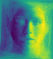

# Accuracy Simulations

This subproject reproduces the classification accuracy results from the paper.

**→ [Open the Notebook](notebooks/run_classification.ipynb)**  
**→ [Open in Colab](https://colab.research.google.com/github/moatary/reproducible_beyond_correlation/blob/main/classification/notebooks/run_classification.ipynb)**

## Models implemented

| Model | File | Description |
|---|---|---|
| WDDWCC | `models/wddwcc.py` | Linear, correlation-based supervised DR |
| WDIWCD | `models/wdiwcd.py` | Linear, independence-based supervised DR (proposed) |
| VAE    | `models/vae.py`    | Baseline Variational Autoencoder |
| VAE+WDIWCD | `models/vae_wdiwcd.py` | Layer-sharing (best model) |

## Main results (Table 8)



| Method | MNIST kNN | Gender kNN | MSE |
|---|---|---|---|
| Only VAE | 84.2 | 68.8 | 0.021 |
| Only WDIWCD | 88.9±1.89^* | 72.6±1.53^* | 0.016±0.004^* |
| **VAE+WDIWCD** | **89.4±2.09^*** | **75.5±2.70^*** | **0.019±0.002^*** |
| VAE+WDDWCC | 89.6±2.18^* | 78.6±3.95^* | 0.020±0.001^* |

*^* p<0.05 vs. Only VAE (paired t-test over 5/10 independent runs)*

## Hyperparameters

See `configs/` for YAML files containing the optimal hyperparameters found during search.
The search procedure is documented in `../finetuning/`.

## Running

```bash
# From repo root:
python classification/train.py --config classification/configs/vae_wdiwcd_optimal.yaml
```

## Cite

```bibtex
@article{moattari2025beyond,
  title   = {Beyond Correlation: Learning Supervised, Sample-Distinct, and
             Eigenimage-Interpretable Representation},
  author  = {Moattari, Mojtaba},
  journal = {arXiv preprint arXiv:2501.XXXXX},
  year    = {2025},
}
```
