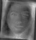

# Hyperparameter Finetuning

This subproject documents the hyperparameter search that produced the
optimal settings reported in the paper's hyperparameter table.

**→ [Open the Notebook](notebooks/run_finetuning.ipynb)**

## Optimal hyperparameters (from paper)

| Model | Parameter | Search space | Optimal value |
|---|---|---|---|
| WDDWCC | LR | {0.001, 0.01, 0.05, 0.1} | 0.01 |
| WDDWCC | Batch | {64, 128, 256} | 128 |
| WDDWCC | MaxIter | {100, 500, 1000, 2000} | 1000 |
| WDDWCC | Components | {4, 8, 16, 32} | 16 |
| WDIWCD | HistBins | {8, 16, 32, 64} | 32 |
| WDIWCD | Components | {4, 8, 16, 32} | 16 |
| VAE | LatentDim | {8, 16, 32, 64} | 16 |
| VAE | Beta (KLD) | {0.1, 0.5, 1.0, 2.0} | 1.0 |
| VAE | Epochs | {50, 100, 200} | 100 |
| VAE+WDIWCD | a (WDIWCD weight) | [0, 1] | **0.80** |
| VAE+WDIWCD | b (KLD weight) | [0, 1] | **0.48** |
| VAE+WDIWCD | c (whole-data weight) | [0, 1] | **0.87** |

## Sensitivity plots





## Running the search

```bash
# Random search (50 trials) for VAE+WDIWCD:
python finetuning/hyperparameter_search.py --model VAE_WDIWCD --max_trials 50

# Generate sensitivity plots:
python finetuning/plot_sensitivity.py
```
