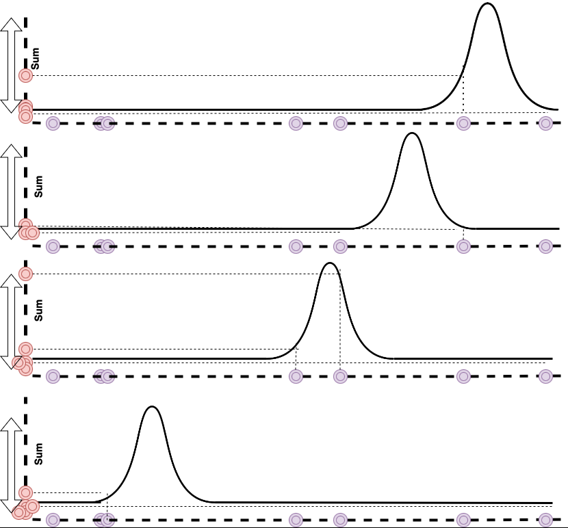

# Interpretability Simulations — Eigenimages & Eigenfaces

This subproject reproduces the eigenimage and eigenface visualisations from the paper.

**→ [Open the Notebook](notebooks/run_interpretability.ipynb)**  
**→ [Open in Colab](https://colab.research.google.com/github/moatary/reproducible_beyond_correlation/blob/main/interpretability/notebooks/run_interpretability.ipynb)**

## What are eigenimages?

A model's learned projection vector `w`, when reshaped into a 28×28 grid,
forms an *eigenimage* — a spatial template showing which pixel patterns the
model finds most informative.  For face datasets these are called *eigenfaces*.

## Results overview



| Method | Diversity | Subpart awareness | Interpretability gain vs RLDA |
|---|---|---|---|
| PCA | Low | Low | baseline |
| RLDA | Medium | Medium | reference |
| WDDWCC | Medium-High | Medium | +26% |
| **WDIWCD** | **High** | **High** | **+120%** |
| VAE+WDIWCD | High | Very High | best |

## Running

```bash
# Generate eigenimage panel for WDIWCD on MNIST:
python interpretability/extract_eigenimages.py --method WDIWCD --dataset mnist

# Generate eigenfaces for all methods on the Gender Face dataset:
for METHOD in PCA RLDA WDDWCC WDIWCD VAE_WDIWCD; do
    python interpretability/extract_eigenimages.py \
        --method $METHOD --dataset gender_face --out_dir interpretability/figures
done
```

## Cite

```bibtex
@article{moattari2025beyond,
  title   = {Beyond Correlation: Learning Supervised, Sample-Distinct, and
             Eigenimage-Interpretable Representation},
  author  = {Moattari, Mojtaba},
  journal = {arXiv preprint arXiv:2501.XXXXX},
  year    = {2025},
}
```
